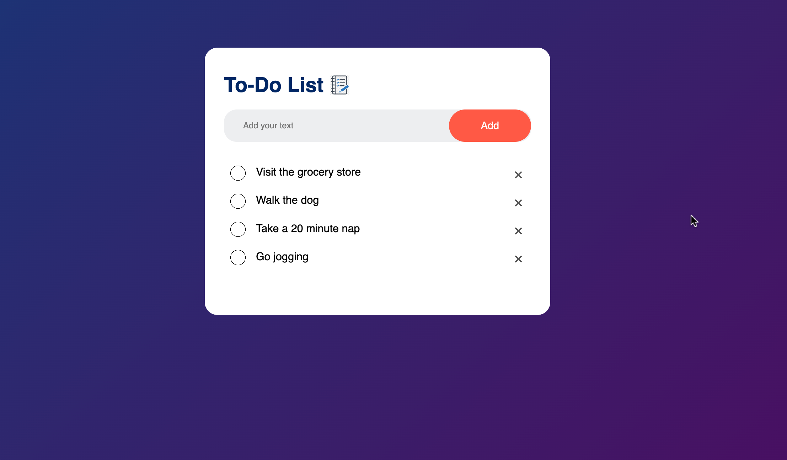

# To-Do Application

A TO DO List App Using vanilla JavaScript, HTML and CSS. 
In this JavaScript Project I used the Local Storage to store the task list in the web browser, so that if you close and restart the browser it will still display your saved tasks.

## Purpose

I built this application to keep my Vanilla JS skills in check.

### [Live Link](https://whoistolu.github.io/ToDo/)

## Built With

- Vanilla JS
- CSS
- HTML



## To get a local copy run the following steps:
- Copy this link [this link](https://github.com/Whoistolu/ToDo)
- Open your terminal or command line
- Run "git clone Paste [this link](https://github.com/Whoistolu/ToDo.git)"
- Open the folder with your code editor
- Create a branch to work on

### Setup

Run :

```
Right click on the index.html file and open with Live Server
```


👤 **Author**

**Toluwase Ajise**
- GitHub: [@Whoistolu](https://github.com/Whoistolu)
- LinkedIn: [Toluwase Ajise](https://www.linkedin.com/in/toluwase-ajise/) 


## 🤝 Contributing

Contributions, issues, and feature requests are welcome!

Feel free to check the [issues page](https://github.com/Whoistolu/ToDo/issues).

## Show your support

Give a ⭐️ if you like this project!